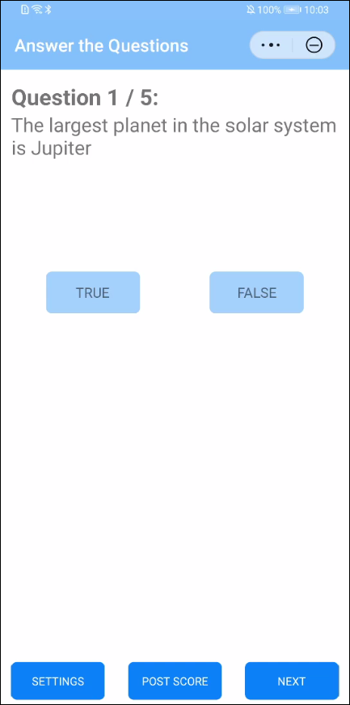
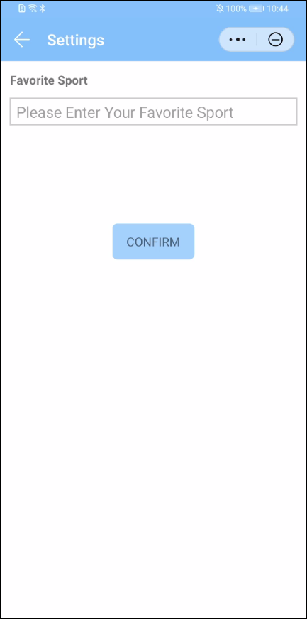

# HMS AnalyticsKit Demo for QuickApp

English | [中文](README_ZH.md)

## Table of Contents

* [Introduction](#introduction)
* [Installation](#installation)
* [Configuration](#configuration)
* [Environment requirements](#environment-requirements)
* [Sample Code](#sample-code)
* [License](#license)

## Introduction

HmsAnalyticsKitDemo is a QuickApp client that applying HUAWEI Hianalytics SDK used for showing how to collect user engagement and user preference.
[Read more about Hianalytics](https://developer.huawei.com/consumer/en/doc/development/HMSCore-Guides/introduction-0000001050745149 ).

## Installation

1. Use HUAWEI QuickApp IDE to open the decompressed project, we provide two demos:
   1. quickapp.hmsanalyticskitdemo: this is a completed code for the sample app.
   2. quickapp.hmsanalyticskitdemo-start: this is a starting code that you'll build upon during this codelab.
2. Use the "Npm -> Start Npm Library" to generate "package.json" file.
3. Run the following command to install the AnalyticsKit SDK for QuickApp:
  
   ```bash
   npm install --save @hw-hmscore/analytics-sdk-quickapp
   ```

## Configuration

Create a QuickApp in AppGallery Connect and obtain the project configuration, then copy it to your QuickApp project.

## Environment requirements

Hardware requirements:

1. A computer
2. An Android phone

Software requirements:

1. The [HUAWEI QuickApp IDE](https://developer.huawei.com/consumer/cn/quickApp-ide/)
2. The package manager [npm](https://www.npmjs.com) , which typically comes with [Node.js](https://nodejs.org/en)
3. The codelab's sample code
4. A terminal/console

## Sample Code

After running the app you should see a screen like this:



Click the button TRUE or FALSE to answer the question; Click the NEXT, show the next question; Click POST SCORE, log the score user got. All the infomations will be upload to Hianalytics, and you can see these infomations in real time using Real-time.

Click button SETTINGS:



You will be asked what your favorite sport is. This choice will be logged to Hianalytics as a User Property.

## Question or issues
If you want to evaluate more about HMS Core,
[HMSCore on Reddit](https://www.reddit.com/r/HuaweiDevelopers/) is for you to keep up with latest news about HMS Core, and to exchange insights with other developers.

If you have questions about how to use HMS samples, try the following options:
- [Stack Overflow](https://stackoverflow.com/questions/tagged/huawei-mobile-services?tab=Votes) is the best place for any programming questions. Be sure to tag your question with 
`huawei-mobile-services`.
- [Huawei Developer Forum](https://forums.developer.huawei.com/forumPortal/en/home?fid=0101187876626530001) HMS Core Module is great for general questions, or seeking recommendations and opinions.

If you run into a bug in our samples, please submit an [issue](https://github.com/HMS-Core/hms-ananlytics-demo-quickapp/issues) to the Repository. Even better you can submit a [Pull Request](https://github.com/HMS-Core/hms-ananlytics-demo-quickapp/pulls) with a fix.

## License

HmsAnalyticsKitDemo is licensed under the [Apache License, version 2.0](http://www.apache.org/licenses/LICENSE-2.0).
