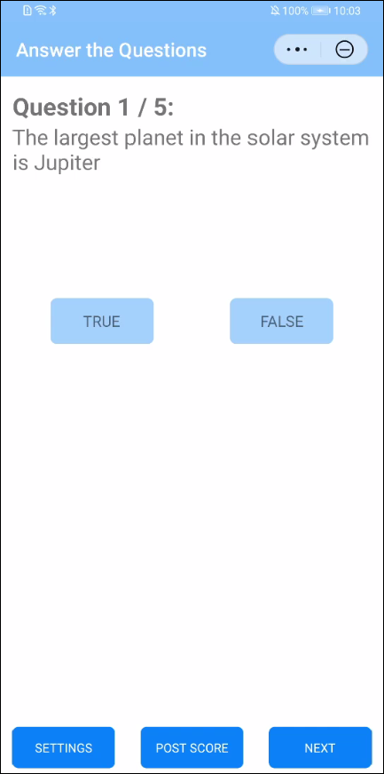
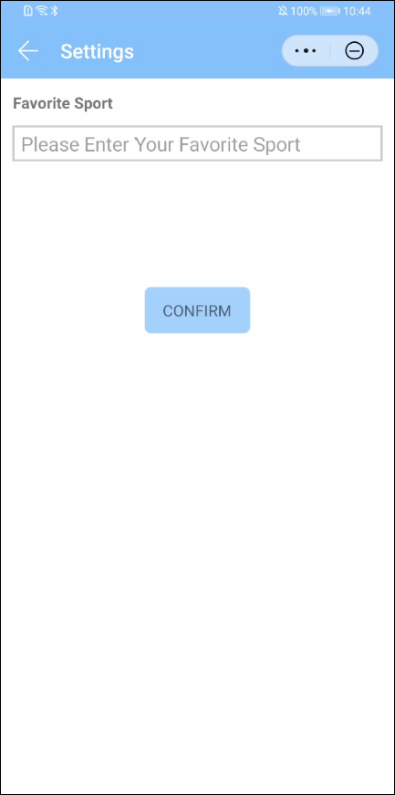

# 华为分析服务QuickApp SDK示例代码

[English](README.md) | 中文

## 目录

* [简介](#简介)
* [安装](#安装)
* [配置](#配置)
* [环境要求](#环境要求)
* [示例代码](#示例代码)
* [授权许可](#授权许可)

## 简介

HmsAnalyticsKitDemo提供了QuickApp应用集成华为Hianalytics SDK的示例代码。其演示了如何通过收集预定义事件和自定义事件以提高用户参与度和用户偏好。
[了解更多有关Hianalytics的信息](https://developer.huawei.com/consumer/cn/doc/development/HMSCore-Guides-V5/introduction-0000001050745149)

## 安装

1. 使用HUAWEI QuickApp IDE打开压缩项目，该示例共包含两个demo:
   1. quickapp.hmsanalyticskitdemo: 示例应用的完整代码
   2. quickapp.hmsanalyticskitdemo-start: 本codelab中编译所依赖的启动代码
2. 点击菜单按钮 "Npm -> 启动第三方NPM库" 生成 "package.json" 文件
3. 执行下面的命令，为QuickApp工程安装华为分析SDK：
  
   ```bash
   npm install --save @hw-hmscore/analytics-sdk-quickapp
   ```

## 配置

在AppGallery Connect中创建应用，获取项目配置，并将项目配置添加到您的QuickApp项目。

## 环境要求

硬件要求：

1. 电脑（台式机或笔记本）
2. 一台android手机

软件要求：

1. [HUAWEI QuickApp IDE](https://developer.huawei.com/consumer/cn/quickApp-ide/)
2. [npm](https://www.npmjs.com) 包管理器，一般随 [Node.js](https://nodejs.org/en) 发布
3. Codelab的示例代码
4. 终端/控制台

## 示例代码

运行该app后，您将会看到如下页面：



点击“TRUE”或“FALSE”按钮进行答题；点击“POST SCORE”按钮记录用户获得的分数。所有信息将被上传到Hianalytics控制台，您可以通过实时监控来实时查看这些信息。

点击“SETTINGS”按钮：



您将被要求提供最喜欢的运动。您的选择将作为用户属性记录到Hianalytics中。

## 技术支持

如果您对HMS Core还处于评估阶段，可在[Reddit社区](https://www.reddit.com/r/HuaweiDevelopers/)获取关于HMS Core的最新讯息，并与其他开发者交流见解。

如果您对使用HMS示例代码有疑问，请尝试：
- 开发过程遇到问题上[Stack Overflow](https://stackoverflow.com/questions/tagged/huawei-mobile-services?tab=Votes)，在`huawei-mobile-services`标签下提问，有华为研发专家在线一对一解决您的问题。
- 到[华为开发者论坛](https://developer.huawei.com/consumer/cn/forum/blockdisplay?fid=18) HMS Core板块与其他开发者进行交流。

如果您在尝试示例代码中遇到问题，请向仓库提交[issue](https://github.com/HMS-Core/hms-analytics-demo-quickapp/issues)，也欢迎您提交[Pull Request](https://github.com/HMS-Core/hms-analytics-demo-quickapp/pulls)。

## 授权许可

HmsAnalyticsKitDemo 经过 [Apache License, version 2.0](http://www.apache.org/licenses/LICENSE-2.0) 许可。
